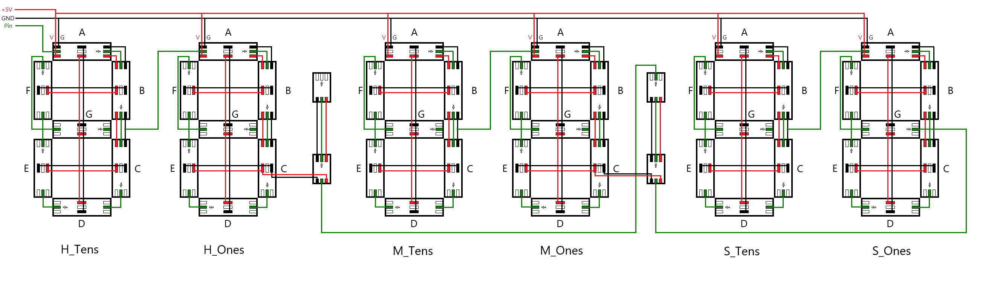
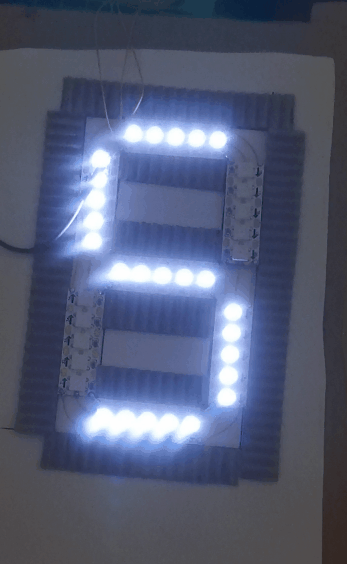

# 簡易燈帶時鐘

## 🚀 介紹
這是一個基於支援 WS281X RGB LED 系列的特效庫所設計的簡易時鐘，利用微控制器和 FastLED 庫控制燈帶並模擬七段顯示器(7-Segment Display)的形式。每個七段顯示器可以自定義 LED 數量，並通過 WIFI 進行時間同步和顏色選擇。

## 🌟 效果

- 顯示時間：可根據當地時區顯示。

  

## 📥 安裝

###### Clone the repository

1. 克隆儲存庫
```sh
git clone https://github.com/dc103096/simple-LED-strip-clock.git
```
2. 將副檔名 .ino 檔案使用Arduino IDE開啟

3. 編譯並寫入指定微處理器

###### 硬體配置要求

- ESP32, ESP32S, Arduino 等支持 FastLED 的微控制器
- WS2812B, WS2812, WS2815 等可定址LED

###### 軟體配置要求

- Arduino IDE
- FastLED 3.6.0

## 🔧 時鐘實體

###### 燈帶

1. 依據自訂長度並裁切燈帶

2. 根據七段顯示器布局排列連接(此處以每段2顆LED為例)

    
3. 單個七段顯示器完成範例
    - 每段2顆LED

      
    - 每段5顆LED

      

## 🤖 Technologies Used

使用 FastLED 代碼庫，用於控制LED。

## 💡 Feedback

如果您有任何反饋或問題，請隨時提出問題。
